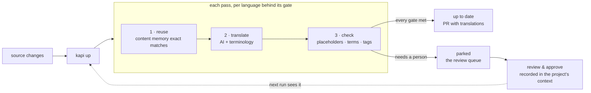

# kapi-workflows

Reusable GitHub Actions workflows for [kapi](https://github.com/neokapi/neokapi), the format-aware content engine. With one `uses:` line, `up.yml` brings a project's content to the state its `kapi.yaml` recipe declares, translations included, and delivers the result as a pull request, and `gate.yml` fails pull requests that do not meet the project's content quality gates. They compose [`setup-kapi`](https://github.com/neokapi/setup-kapi) and [`kapi-action`](https://github.com/neokapi/kapi-action); use those directly when you need a custom job shape.

## `up.yml` — catch up on a schedule, deliver a PR

```yaml
name: Translations
on:
  schedule:
    - cron: "0 6 * * 1-5"
  workflow_dispatch:

jobs:
  up:
    uses: neokapi/kapi-workflows/.github/workflows/up.yml@v1
    permissions:
      contents: write
      pull-requests: write
    secrets:
      bowrain-auth-token: ${{ secrets.BOWRAIN_AUTH_TOKEN }}   # server-connected projects
      # anthropic-api-key: ${{ secrets.ANTHROPIC_API_KEY }}   # or local-engine runs
```

Runs `kapi up` — the kapi loop — and opens a pull request with the produced translations and a kapi up report (outcome, passes, parked locales). A run that **parks** (work remains that needs a person) still delivers what it caught up; set `fail-on-parked: true` to block instead.

Inputs: `project`, `args`, `create-pull-request` (default `true`), `fail-on-parked`, `context-sync` (default `false`), `plugins` (default `bowrain`), `kapi-version`, `server`, `runs-on`. Secrets: `bowrain-auth-token`, `anthropic-api-key`, `deliver-token` (a PAT or App token when CI/deploys should react to the delivered translations; the default `GITHUB_TOKEN` triggers no workflows). Outputs: `outcome`, `passes`, `parked-locales`, `has-changes`, `pull-request-url`.

### What a run does

`kapi up` settles the source first: the source checks run, and a block whose source is below the recipe's `defaults.translate_after` level is held rather than translated. Then, each pass, for every language behind its ship gate: **reuse** exact content-memory matches first (free), **translate** what remains with the configured AI provider plus the project's terms and voice, then **check** what was produced: placeholder integrity, inline tags, do-not-translate terms. A unit with a failing finding still counts as *translated*, and the finding holds its language out of shipping until it is fixed, so bad output never lifts a language over its gate. Passes repeat until every gate clears or nothing progresses.



Parked work is the review queue, not an error: a person reviews and approves it, and the approval is recorded in the project's context (with `kapi apply` or the Review page of Kapi Desktop), or the connected server records it. A machine takes a target unit from *draft* to *translated*; an approval takes it to *established* and raises the `established` coverage the ship gate measures. From kapi 1.3 the project's context (terms, voice profiles, content memory and recorded decisions) lives in kapi's workspace outside git, and a project shares it through the context backend its `kapi.yaml` declares, with `kapi context push` and `kapi context pull`. Set `context-sync: true` on `up.yml` so a run takes in what the team pushed and pushes what it recorded; the next run and the next gate then see the approval.

## `gate.yml` — fail PRs on unmet content quality gates

```yaml
name: Ship gate
on:
  pull_request:
    paths: ["content/**", "src/locales/**"]

jobs:
  ship-gate:
    uses: neokapi/kapi-workflows/.github/workflows/gate.yml@v1
    permissions:
      contents: read
      pull-requests: write
```

Runs `kapi check --ship`: the project's bound gates (voice, terms and QA) plus its ship and source coverage gates. Each finding either fails its gate or only reports. An unmet gate exits `3`, fails the job with a distinct "gate unmet" annotation, and posts one sticky report comment on the PR. A check that did not run, because it examined no content or a checker could not show it is able to fail, exits `4` and fails the job with the cause. Ordinary builds never fail on target-language drift; the gate is the explicit, opt-in enforcement point. An `established` threshold counts the approvals in the project's context, so a project that shares its context through a backend sets `context-sync: pull`.

Inputs: `project`, `args` (default `--ship`), `plugins`, `kapi-version`, `pr-comment` (default `true`), `fetch-depth` (default `1`), `context-sync` (default `false`), `server`, `runs-on`. Output: `gate` (`pass`/`fail`, empty when the check did not run).

A diff-scoped check reads the commits it compares, so pass `fetch-depth: 0` with `--diff-range` or `--diff-against`:

```yaml
jobs:
  ship-gate:
    uses: neokapi/kapi-workflows/.github/workflows/gate.yml@v1
    with:
      args: "--diff-range ${{ github.event.pull_request.base.sha }}...${{ github.event.pull_request.head.sha }}"
      fetch-depth: 0
```

## Versions

`@v1` is a floating major tag. The workflows install kapi 1.2.0 by default. Set `kapi-version` to another release to pin it, or to `latest` for the newest stable release.

## License

Apache-2.0 — see [LICENSE](LICENSE).
