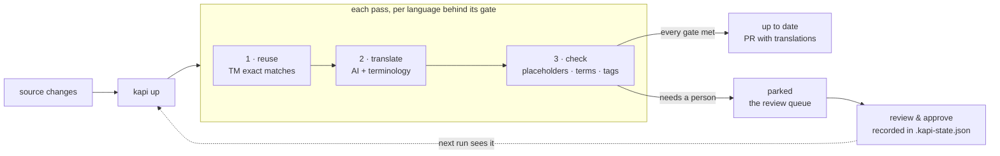

# kapi-workflows

Reusable GitHub Actions workflows for [kapi](https://github.com/neokapi/neokapi) — the whole continuous-localization happy path as one `uses:` line each. They compose [`setup-kapi`](https://github.com/neokapi/setup-kapi) and [`kapi-action`](https://github.com/neokapi/kapi-action); use those directly when you need a custom job shape.

## `up.yml` — catch up on a schedule, deliver a PR

```yaml
name: Translations
on:
  schedule:
    - cron: "0 6 * * 1-5"
  workflow_dispatch:

jobs:
  up:
    uses: neokapi/kapi-workflows/.github/workflows/up.yml@v1
    permissions:
      contents: write
      pull-requests: write
    secrets:
      bowrain-auth-token: ${{ secrets.BOWRAIN_AUTH_TOKEN }}   # server-connected projects
      # anthropic-api-key: ${{ secrets.ANTHROPIC_API_KEY }}   # or local-engine runs
```

Runs `kapi up` — the kapi loop — and opens a pull request with the produced translations and a kapi up report (outcome, passes, parked locales). A run that **parks** (work remains that needs a person) still delivers what it caught up; set `fail-on-parked: true` to block instead.

Inputs: `project`, `args`, `create-pull-request` (default `true`), `fail-on-parked`, `plugins` (default `bowrain`), `kapi-version`, `server`, `runs-on`. Outputs: `outcome`, `passes`, `parked-locales`, `pull-request-url`.

### What a run does

Each pass, for every language behind its ship gate: **reuse** exact translation-memory matches first (free), **translate** what remains with the configured AI provider plus the project's terminology, then **check** what was produced — placeholder integrity, inline tags, do-not-translate terms. A unit with a failing finding counts as *drafted*, not translated, so bad output can never lift a language over its gate. Passes repeat until every gate clears or nothing progresses.



Parked work is the review queue, not an error: a person reviews and approves it, the decision is recorded in the committed `.kapi-state.json` state store (or on the connected server), and the `reviewed` coverage the ship gate measures goes up — the next run and the next gate see it.

## `gate.yml` — fail PRs on unmet content quality gates

```yaml
name: Ship gate
on:
  pull_request:
    paths: ["content/**", "src/locales/**"]

jobs:
  ship-gate:
    uses: neokapi/kapi-workflows/.github/workflows/gate.yml@v1
    permissions:
      contents: read
      pull-requests: write
```

Runs `kapi check --ship` — the project's bound quality gates (brand, terminology, QA) plus its ship/source coverage gates. An unmet gate exits `3`, fails the job with a distinct "gate unmet" annotation, and posts one sticky report comment on the PR. Ordinary builds never fail on target-language drift; the gate is the explicit, opt-in enforcement point.

Inputs: `project`, `args` (default `--ship`), `plugins`, `kapi-version`, `pr-comment` (default `true`), `server`, `runs-on`. Output: `gate` (`pass`/`fail`).

## Versions

`@v1` is a floating major tag. `kapi up` and `check --ship` ship in kapi 1.2.0; until 1.2.0 is stable the workflows pin the release candidate CLI (`kapi-version: 1.2.0-rc14`) — override the input to choose your own.

## License

Apache-2.0 — see [LICENSE](LICENSE).
